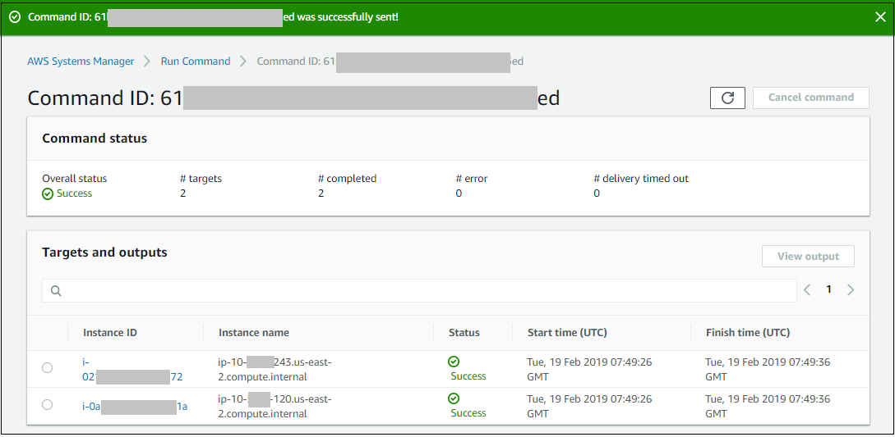

# Automating Security Assessment and Remediation Using Amazon Inspector and AWS Systems Manager - Assess Phase

In the previous Build Phase, you built a CloudFormation stack that contains
some Amazon EC2 instances behind an application load balancer.
You are now going to use Amazon Inspector to scan the instances and identify
findings that need to be remediated.  In this section you will do the
following tasks:

1. Identify the stack you built
2. Look up the Amazon EC2 instances that were created as a result of the stack
3. Use AWS Systems Manager to install the Amazon Inspector agent on the instances
4. Use Amazon Inspector to scan the instances

## Identify the stack that you built

1. Go to the CloudFormation console in the same AWS region in which you created the stack in the Build Phase.  You should see a list of stacks similar to the figure below. Locate the stack you created.  In this documentation, the name of the stack is *pww*.  Copy this stack name into a scratch file on your workstation in case you need it later.

    

## Look up the Amazon EC2 instances

1.  Go to the Amazon EC2 console and look for the instances associated with the stack.  They will have a name that begins with the stack name followed by *-node*, *pww-node* in this example.  Copy the two instance ids (they begin with *i-* and are followed by a series of digits) into your scratch file in case you need them.  Select one of them by checking the box to the left of the instance and then click on the *Tags* tab.  You should see a table like that in the figure below.

    

2.  Notice that the instance has tags reflecting the CloudFormation stack name and stack id.  These tags are added because of settings in the auto scaling group which propogate tags to newly created instances.  You will take advantage of this feature when you set up Amazon Inspector later in this phase.

## Install the Inspector Agent on the Amazon EC2 instances

1.  Go to the AWS Systems Manager console.

2.  Under the *Actions* menu on the left, click **Run Command**.  You will be taken to the AWS Systems Manager Run Command home screen.  Click the **Run a Command** button and the *Run a Command* screen will appear.

3.  In the *Command document* window, page through the available documents until you find the document named *AmazonInspector-ManageAWSAgent*.  Click the radio button to the left of that document as shown in the figure below.

    

4.  Scroll further down until you can see the *Targets* window.  Click the **Specifying a tag** radio button.  For the tag key, enter *aws:cloudformation:stack-name*.  For the value enter the name of the CloudFormation stack you created (*pww* in this example) and click *Add*.  Your screen should be similar to the figure below.

    

5.  Scroll down to the *Output options* window.  Clear the box next to *Enable writing to an S3 bucket* as shown in the figure below.

    

6.  Scroll to the bottom of the screen and click the *Run* button.  You will then be be taken to the command status window while the installation of the Amazon Inspector is running.  You can periodically update the command status by clicking on the refresh button within the window.   After the commands finish running, the *Overall status* should be *Success* as shown in the figure below.

    

Click [here](./remediate.md) to proceed to the Remediate Phase.

