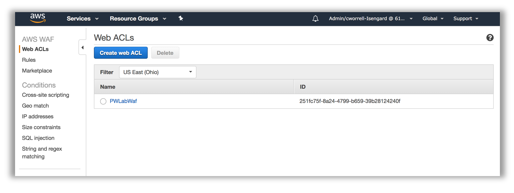
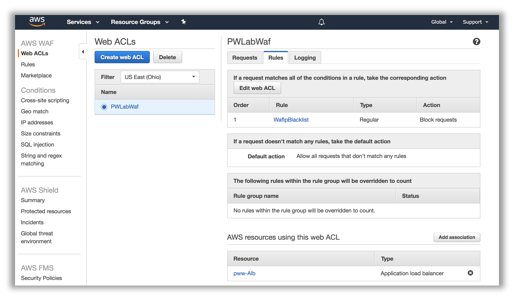
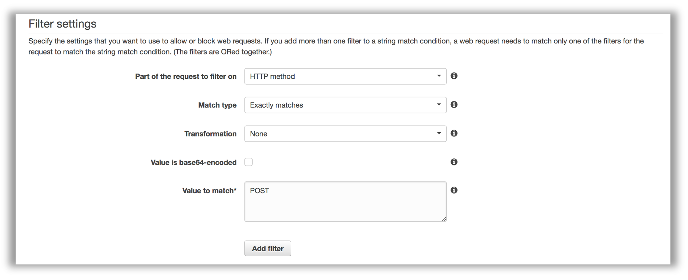
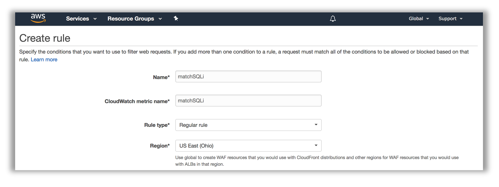
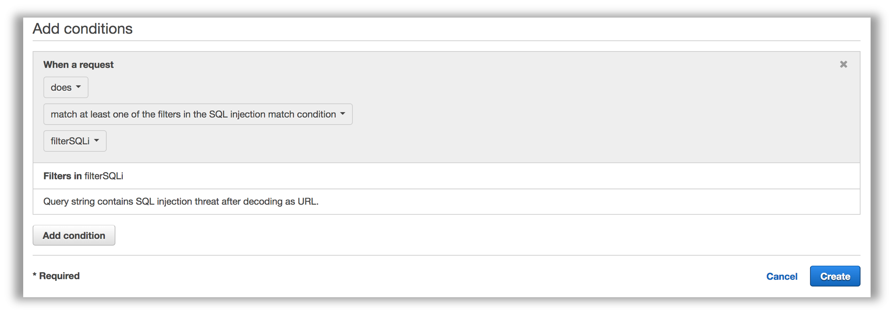
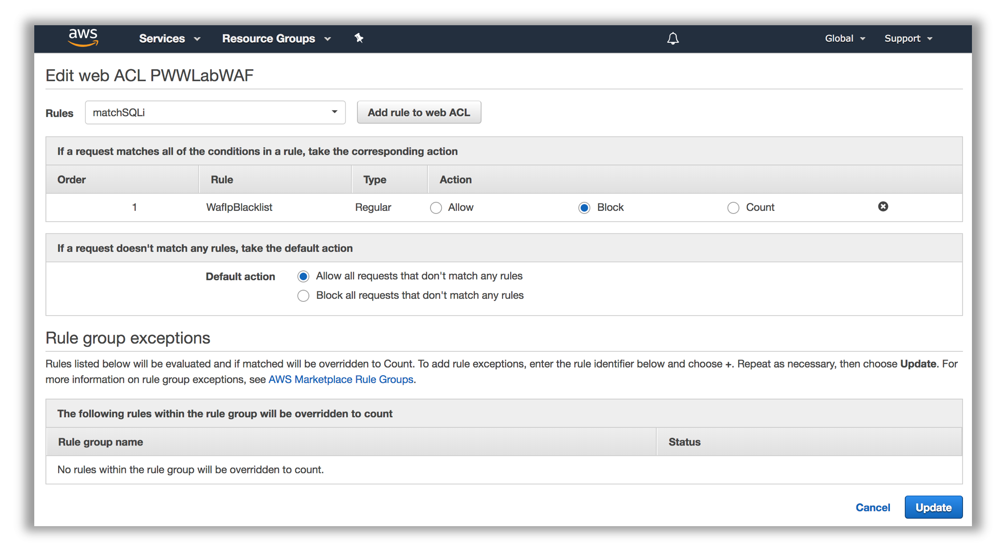

# Mitigating Common Web Application Attack Vectors Using AWS WAF - Remediate Phase

In the previous Build Phase, you identified several vulnerabilities in your web application.
You are now going to design and implement an AWS WAF ruleset to help mitigate these vulnerabilities. In this section you will do the following tasks:

1. Identify the WAF ACL for your site
2. AWS WAF rule design and considerations
3. Rule creation walkthrough
4. Mitigating Common Vulnerabilities & Monitoring for Attacks

## Identify the WAF ACL for your Site

1. If needed, go to <a href="https://console.aws.amazon.com/console/home" target="_blank">https://console.aws.amazon.com/console/home</a>. You will be redirected to the AWS Management Console dashboard on successful login:

Make sure you select the appropriate AWS Region when working in the AWS Management Console (top right corner, on the menu bar).

2. From the Management Console dashboard, navigate to the AWS WAF & Shield service console. You can do that several ways:
    - Type “waf” in the AWS services panel search box and select the resulting option
    - Expand the Services drop down menu (top left on the menu bar) and choose WAF & Shield
    - Expand the All services area of the AWS services panel and choose WAF & Shield
Once selected, you will be redirected to the AWS WAF & AWS Shield service console. You may see an initial landing page at first. Choose Go to AWS WAF:

3. In the side bar menu on the right, pick the Web ACLs option under the AWS WAF heading. If the list of Web ACLs appears empty select the correct AWS Region as indicated on your credentials card in the Filter dropdown:

4. Click on the WAF Web ACL Name to select the existing Web ACL. Once the detail pane is loaded on the left of your screen, you will see 2 tabs: Requests and Rules. Toggle to Rules:

Validate that you are able to see a pre-existing rule, configured to block requests, and that your Web ACL is associated with an Application load balancer resource. You can drill down further into the properties of the existing rule, by clicking on the rule name. You should see 2 entries into the associated IP address list for the loopback/localhost IP addresses (127.0.0.0/8, ::1/128).

##AWS WAF rule design and considerations

###Basics

Writing rules for AWS WAF involves the creation of conditions. Conditions are lists of specific filters (patterns) that are being matched against the HTTP request components processed by AWS WAF. The filters, including their attributes, are specific to the type of condition supported by AWS WAF. A condition, as a whole, is considered as matched, if any one of the listed filters is matched. Conditions are independent and reusable resources within the regional scope where they are created.

Rules contain one or more conditions. Each condition attached to a rule is called a predicate. Predicates are evaluated using Boolean logic. A predicate is evaluated as matched or not matched (negated predicted), and multiple predicates are evaluated using Boolean AND – all predicates must match for the rule action to be triggered. Rules are also independent and reusable resources within the regional scope where they are created.

Web ACLs are ordered lists of rules. They are evaluated in order for each HTTP request and the action of the first matching rule is taken by the WAF engine, whether that is to allow, block or count the request. If no rule matches, the default action of the web ACL prevails. Multiple web ACLs can reuse the same rules, and multiple rules can reuse the same conditions assuming that is desirable from a change management process point of view for your workloads. This creates effectively a dependency tree between these AWS WAF components.

###Rule Design

To create a rule, you have to create the relevant match conditions first. This process requires planning for effective rule building. Use the following guiding questions:

1.	What is the intended purpose of the rule?
2.	What HTTP request components apply to the purpose of the rule?
3.	Do you already have conditions targeting those request components that you can reuse? Is that desirable?
4.	How can you define the purpose of the rule in a Boolean logic expression?
5.	What conditions do you need to create to implement the logic?
6.	Are any transformations relevant to my input content type?

For example, we want to build a rule to detect and block SQL Injection in received form input requests. Let’s see how these questions help us plan the implementation of the rule:

####Rule purpose:

- **Detect SQL Injection in form input HTTP requests, use ‘block’ action in Web ACL**

####HTTP request components:

- **Request Method** – form input typically gets submitted using a POST HTTP request method
- **Request Body** – form input is typically encoded in the body of the HTTP request 

####Define the purpose of the rule using Boolean logic:

- If **Request Method = POST** and **Request Body contains suspected SQL Injection** then **block**

####Conditions to implement:

- **String Match Condition** targeting the request **METHOD** field, expecting the exact value **POST**
- **SQL Injection Match Condition** targeting the request **BODY** field

####Relevant transformations:

- **SQL Injection Match Condition** form input is sometimes HTML encoded, so it’s a good idea to apply the **HTML_ENTITY_DECODE** transformation. Other transformations might also apply, such as **URL_DECODE**

####Rules to implement:

- Rule with 2 predicates matching both the string matching condition and SQL injection condition

##Console Walkthrough - Creating a Condition and Rule

1. In the AWS WAF console, create a string match condition by selecting **String and regex** matching from the side-bar menu to the left of the console, under the **Conditions** heading.

2.	Click on **Create Condition**:

3.	Provide the name and region. Set the **type** to **String match**.

4.	Add a filter (pattern) to the condition. Set the **Part of the request to filter on** to **HTTP method**, the **match type** to **Exactly matches**, the transformation to **None** and the value to match as **POST**. Click **Add filter**.

5.	You can add multiple filters to the string match condition. Once you are confident the list is complete, click **Create** at the bottom of the screen.

6\. With the condition created, and any additional conditions created based on need as well, you are ready to create a rule. In the AWS WAF console, select **Rules** from the side-bar menu to the left of the console, under the **AWS WAF** heading.

7\.	Click on **Create Rule**:

8.	Provide the name, metric name and region. Set the **rule type** to **Regular rule**.

9.	Add a condition to the rule. For our rule example, choose “When a request” **does** (no negation) **match at least one of the filters in the string match condition**. Choose the string match condition you have previously created.

10.	Click **Add Condition** and repeat step 9 for any additional conditions you wish to add.

11\. Click **Create** at the bottom of the screen when you have added all relevant conditions.

12\. Follow the steps in the “Identify the WAF ACL for your site” section above to go back to the Rules tab of your web ACL.

13\.	Click **Edit web ACL**.

14\. In the **Rules** dropdown, select your rule, and click **Add rule to web ACL**.

15\. Reorder the rules as appropriate for your use case.

16\. Click **Update** to persist the changes.

## Mitigating Common Vulnerabilities & Monitoring for Attacks

For a more comprehensive discussion of common vulnerabilities for web applications, as well as how to mitigate them using AWS WAF, and other AWS services, please refer to the <a href="https://d0.awsstatic.com/whitepapers/Security/aws-waf-owasp.pdf" target="_blank">Use AWS WAF to Mitigate OWASP’s Top 10 Web Application Vulnerabilities whitepaper</a>.

In this phase, we will have a set of 6 exercises walking you through the process of building a basic mitigation rule set for common vulnerabilities. We will build these rules from scratch, so you can gain familiarity with the AWS WAF programming model and you can then write rules specific to your applications. 

!!! info "Note About Excersise Solutions"
    **We encourage you to attempt to create the rules on your own but have included the solutions as a backup in case you get stuck.** You can test your ACL ruleset at any time using the Red Team Host. For AWS sponsored event, you can also view test results on the <a href="http://waflabdash.awssecworkshops.com/" target="_blank">WAF Lab Dashboard</a>.

### 1. SQL Injection & Cross Site Scripting Mitigation

Use the SQL injection, cross-site scripting, as well as string and regex matching conditions to build rules that mitigate injection attacks and cross site scripting attacks.

Consider the following:
- How does your web application accept end-user input (whether directly or indirectly). Which HTTP request components does that input get inserted into?
- What kind of content encoding considerations do you need to factor in for the input format?
- What considerations do you need to account for in regards to false positives? For example, does your application legitimately need to accept SQL statements as input?

How do the requirements derived from the above questions affect your solution?

??? info "Solution"
    1.	create SQLi condition named filterSQLi
        1. query_string, url decode
        2. body, html entity decode
        3. header, cookie, url decode
    2.  create SQLi rule named matchSQLi
    	1. type regular
        2. does match SQLi condition: filterSQLi

### 2. Limit Attack Footprint

Use the string and regex matching conditions along with geo match and IP address match conditions to build rules that limit the attack footprint against the exposed components of your application.

Consider the following:
•	Does your web application have server-side include components in the public web path?
•	Does your web application have components at exposed paths that are not used (or dependencies have such functions)?
•	Do you have administrative, management, status or health check paths and components that aren’t meant for end user access?

You should consider blocking access to such elements, or limiting access to known sources, either whitelisted IP addresses or geographic locations.

??? info "Solution"
    1.	create XSS condition named filterXSS
        1.	query_string, url decode
        2.	body, html entity decode
        3.	body, url decode
        4.	header, cookie, url decode
    2.	create XSS rule named matchXSS
        1. type regular
        2. does match XSS condition: filterXSS
        3. does not match string match condition: filterXSSPathException

### 3. Enforce Request Hygiene

Use the string and regex matching, size constraints and IP address match conditions to build rules that block non-conforming or low value HTTP requests.

Consider the following:
•	Are there limits to the size of the various HTTP request components relevant to your web application? For example, does your application ever use URIs that are longer than 100 characters in size?
•	Are there specific HTTP request components without which your application cannot operate effectively (e.g. CSRF token header, authorization header, referrer header)?

Build rules that ensure the requests your application ends up processing are valid, conforming and valuable.

??? info "Solution"
    1.	create string match condition named filterFormProcessor
        1.	uri, starts with, no transform, “/form.php”
    2.	create string match condition named filterPOSTMethod
        1.	uri, exactly matches, no transform, “/form.php”
    3.	create regex match condition named filterCSRFToken
        1.	header x-csrf-token, matches pattern: ^[0-9a-f]{40}$
    4.	create rule named matchCSRF
        1.	type regular
        2.	does match string condition: filterFormProcessor
        3.	does match string condition: filterPOSTMethod
        4.	does not match regex match condition: filterCSRFToken
    5.	add rules to Web ACL

### 4. Mitigate File Inclusion & Path Traversal

Use the string and regex matching conditions to build rules that block specific patterns indicative of unwanted path traversal or file inclusion.

Consider the following:

- Can end users browse the directory structure of your web folders? Do you have directory indexes enabled?
- Is your application (or any dependency components) use input parameters in filesystem or remote URL references? 
- Do you adequately lock down access so input paths cannot be manipulated?
- What considerations do you need to account for in regards to false positives (directory traversal signature patterns)?  

Build rules that ensure the relevant HTTP request components used for input into paths do not contain known path traversal patterns.

??? info "Solution"
    1.	create string match condition named filterTraversal
        1. uri, starts with, url_decode, /include
        2. query_string, contains, url_decode, “../“
        3. query_string, contains, url_decode, “://“
    2.	create rule named matchTraversal
        1. type regular
        2. does match string condition: filterTraversal
    3.	add rules to Web ACL

### 5. Detect & Mitigate Anomalies

What constitutes an anomaly in regards to your web application? A few common anomaly patterns are:

- Unusually elevated volume of requests in general
- Unusually elevated volumes of requests to specific URI paths
- Unusually elevated levels of requests generating specific non-HTTP status 200 responses
- Unusually elevated volumes from certain sources (IPs, geographies)
- Usual request signatures (referrers, user agent strings, content types, etc)

Do you have mechanisms in place to detect such patterns? If so, can you build rules to mitigate them?

??? info "Solution"
    1.	create string match condition named filterLoginProcessor
        1.	uri, starts with, no transform, “/login.php”
    2.	create rule named matchRateLogin
        1.	type rate-based, 2000
        2.	does match string condition: filterLoginProcessor
        3.	does match string condition: filterPOSTMethod
    3.	add rules to Web ACL

### 6. Reputation Lists, Nuisance Requests (Optional)

Reputation lists (whitelists or blacklists) are a good way to filter and stop servicing low value requests. This can reduce operating costs, and reduce exposure to attack vectors. Reputation lists can be self-maintained: lists of identifiable actors that you have determined are undesired. They can be identified any number of ways:

- the source IP address
- the user agent string
- reuse of hijacked authorization or session tokens,
- attempting to make requests to paths that clearly do not exist in your application but are well known vulnerable software packages (probing)

Build blacklists of such actors using the relevant conditions and set up rules to match and block them. An example IP-based blacklist already exists in your sandbox environment.

Reputation lists can also be maintained by third parties. The AWS WAF Security Automations allow you to implement IP-based reputation lists.

---

Click [here](./verify.md) to proceed to the Verify Phase.
