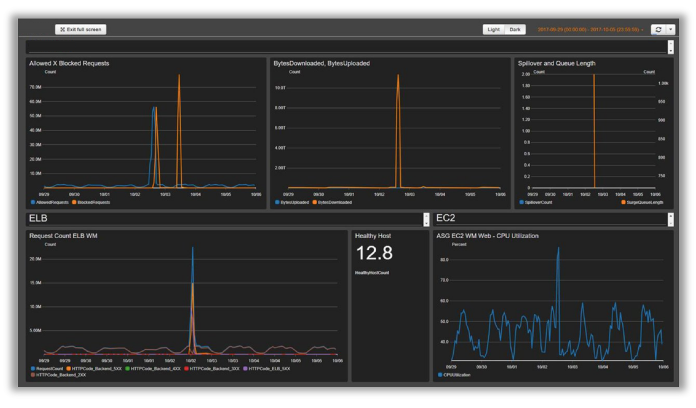

# Mitigating Common Web Application Attack Vectors Using AWS WAF - Verify Phase

In the previous Build Phase, you implemented an AWS WAF ruleset to protect your site from common attack vectors. You are now going to reassess the posture of the site to confirm the rules are performing as intended and blocking the simulated malicious requests.

1. Confirm malicious requests are blocked by WAF policy
2. Implement WAF monitoring dashboard using Amazon CloudWatch (Optional)

## Confirm malicious requests are blocked by WAF policy

If needed, start a Session Manager connection to your Red Team Host, the scanner script can be invoked by typing the following command while in the _/usr/bin_ directory:

````
python3 scanner.py http://your-alb-endpoint
````

Confirm that all of the tests in the script pass. If requests (other than canary) are not being blocked, go back to the remediate phase and confirm your conditions and rules are properly configured.


You should also see green for your unique Id <a href="http://waflabdash.awssecworkshops.com/" target="_blank">on the WAF scanning results dashboard</a>.


## Implement WAF monitoring dashboard using Amazon CloudWatch (Optional)

Use CloudWatch Dashboards to create a monitoring system for your protection layer. The following AWS article details this process: 
https://aws.amazon.com/blogs/aws/cloudwatch-dashboards-create-use-customized-metrics-views/

Here are some sample of metrics that you can use. Starting from top left side, in clockwise order, we have:



- **Allowed vs Blocked Requests**: if you receive a surge in allowed access (2 times normal peak access) or blocked access (any period that identifies more than 1,000 blocked requests), you can configure CloudWatch to send an alert. The idea here is to track known DDoS (when blocked requests increase) or new version of attack (when the requests are allowed to access the system);

- **BytesDownloaded vs. Uploaded**: help you identify when DDoS attack targets a service that doesn't need to receive a huge amount of access in order to exhaust resources (ex: search engine component sending MBs of information for one specific request parameters set);

- **ELB Spillover and Queue length**: use these metrics to verify if the attack is already causing damage to the infrastructure and/or for some reason, the attacker is bypassing protection layer and attacking directly unprotected resources;

- **ELB Request Count**: same as above, helps you identify damage by checking if the attacker is bypassing protection layer and/or CloudFront cache; review rules to increase cache hit rate;

- **ELB Healthy Host**: another system health check metric;

- **ASG CPU Utilization**: identify if the attacker is not only bypassing the CloudFront/WAF but also the ELB layer, also use to identify the damage impact of an attack;


---

Click [here](/inspector-sm/index.md) to proceed to the next workshop module.